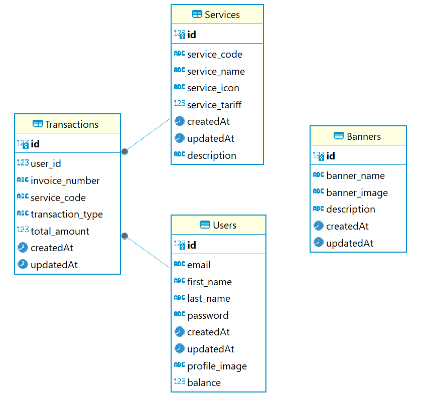

# API Contract SIMS PPOB

This project demonstrates a REST API built with Node.js and Express.js. The API features modules for User Registration, Login, Balance Check, Top Up, and Transaction services, including payments for services such as Mobile Top-up, Game Vouchers, and more.

## Deployment

The API is deployed at [https://api-ppob.hackimtech.com](https://api-ppob.hackimtech.com).

## Postman Collection

You can find the Postman Collection for this API [here](https://api.postman.com/collections/33199697-9cbd2350-259a-4492-acd3-6a18ec19fc3f?access_key=PMAT-01J6KYC6PPXZK977VQ6VQTE9MG).

This collection includes examples of all available API endpoints and makes it easier to test and interact with the API.

## Project Features:

- User Registration and Login: Users can register and log in to the system with authentication handled through JWT.
- Balance Check: Users can check their current account balance.
- Top Up: Users can add funds to their balance.
- Transaction Services: Users can pay for various services, with their balance being deducted accordingly.
- Transaction History: Users can view their past transactions, including details of services purchased.

## Database Schema



## Database Setup

To set up the PostgreSQL database, you can use the following commands in your terminal:

### Create the database:

```bash
npm run db:create
```

### Run migrations to set up the schema:

```bash
npm run db:migrate
```

### Seed the database with initial data:

```bash
npm run db:seed
```

### To reset the database (drop, create, migrate, and seed), run:

```bash
npm run db:reset
```

### Running the API

```bash
npm run dev
```

## Installation and Setup

To set up this project locally, follow these steps:

### Prerequisites

- Node.js and npm installed on your machine.
- PostgreSQL database.

### Installation Steps

1. Clone the Repository:

```bash
git clone https://github.com/hackim18/ppob-api
cd ppob-api
```

2. Install Dependencies:
   Install all required dependencies using npm:

```bash
npm install
```

3. Set up Environment Variables:
   Create a .env file in the project root directory and add the following environment variables:

```bash
PORT=3000
JWT_SECRET=<your_jwt_secret>
DATABASE_URL=<your_database_url>
CLOUDINARY_CLOUD_NAME=<your_cloudinary_cloud_name>
CLOUDINARY_API_KEY=<your_cloudinary_api_key>
CLOUDINARY_API_SECRET=<your_cloudinary_api_secret>
```

4. Start the Server:
   Start the Express.js server:

```bash
npm run dev
```

The server will start on http://localhost:3000.

## Authentication & User Management

### 1. Login

Endpoint: POST /login
Description: Authenticate the user and return an access token.
Request Body:
json

```json
{
  "email": "string", // User's email
  "password": "string" // User's password (min 8 characters)
}
```

Response:
Success: 200 OK
json

```json
{
  "message": "Login success",
  "data": {
    "token": "string" // JWT access token
  }
}
```

Error: 401 Unauthorized
json

```json
{
  "name": "Unauthenticated",
  "message": "Email or password is incorrect"
}
```

### 2. Register

Endpoint: POST /register
Description: Create a new user account.
Request Body:
json

```json
{
  "email": "string", // User's email
  "password": "string", // User's password (min 8 characters)
  "first_name": "string", // User's first name
  "last_name": "string" // User's last name
}
```

Response:
Success: 201 Created
json

```json
{
  "message": "Register success",
  "data": {
    "id": number,  // User ID
    "email": "string",  // User's email
    "first_name": "string",  // User's first name
    "last_name": "string"  // User's last name
  }
}
```

Error: 409 Conflict
json

```json
{
  "name": "Conflict",
  "message": "Email is already registered"
}
```

### 3. Get Profile

Endpoint: GET /profile
Description: Retrieve the authenticated user's profile.
Headers:
Authorization: Bearer <access_token> (Required)
Response:
Success: 200 OK
json

```json
{
  "message": "Success",
  "data": {
    "id": number,  // User ID
    "email": "string",  // User's email
    "first_name": "string",  // User's first name
    "last_name": "string"  // User's last name
  }
}
```

### 4. Update Profile

Endpoint: PUT /profile
Description: Update the authenticated user's profile.
Headers:
Authorization: Bearer <access_token> (Required)
Request Body:
json

```json
{
  "first_name": "string", // User's new first name
  "last_name": "string" // User's new last name
}
```

Response:
Success: 200 OK
json

```json
{
  "message": "Update success",
  "data": {
    "id": number,  // User ID
    "email": "string",  // User's email
    "first_name": "string",  // Updated first name
    "last_name": "string"  // Updated last name
  }
}
```

### 5. Update Profile Image

Endpoint: PUT /profile/image
Description: Update the authenticated user's profile image.
Headers:
Authorization: Bearer <access_token> (Required)
Request Body:
multipart/form-data containing the image file
Response:
Success: 200 OK
json

```json
{
  "message": "Update success",
  "data": {
    "id": number,  // User ID
    "email": "string",  // User's email
    "first_name": "string",  // User's first name
    "last_name": "string",  // User's last name
    "profile_image": "string"  // URL to the updated profile image
  }
}
```

## Transaction Management

### 1. Get Balance

Endpoint: GET /balance
Description: Retrieve the authenticated user's current balance.
Headers:
Authorization: Bearer <access_token> (Required)
Response:
Success: 200 OK
json

```json
{
  "message": "Success",
  "data": {
    "balance": number  // User's current balance
  }
}
```

### 2. Top Up Balance

Endpoint: POST /topup
Description: Top up the authenticated user's balance.
Headers:
Authorization: Bearer <access_token> (Required)
Request Body:
json

```json
{
  "top_up_amount": number  // Amount to top up (must be a positive integer)
}
```

Response:
Success: 200 OK
json

```json
{
  "message": "Top up success",
  "data": {
    "balance": number  // Updated balance
  }
}
```

### 3. Pay for Service

Endpoint: POST /transaction
Description: Pay for a service.
Headers:
Authorization: Bearer <access_token> (Required)
Request Body:
json

```json
{
  "service_code": "string" // Service code to be paid for
}
```

Response:
Success: 200 OK
json

```json
{
  "message": "Pay success",
  "data": {
    "invoice_number": "string",  // Invoice number
    "service_code": "string",  // Service code
    "transaction_type": "PAYMENT",  // Transaction type
    "total_amount": number,  // Total amount paid
    "createdAt": "string"  // Transaction date and time
  }
}
```

### 4. Transaction History

Endpoint: GET /transaction/history
Description: Retrieve the authenticated user's transaction history.
Headers:
Authorization: Bearer <access_token> (Required)
Query Parameters:
offset (optional): Pagination offset (default: 0)
limit (optional): Number of records to return (default: 5)
Response:
Success: 200 OK
json

```json
{
  "message": "Success",
  "data": {
    "offset": number,  // Current offset
    "limit": number,  // Current limit
    "records": [
      {
        "invoice_number": "string",  // Invoice number
        "service_name": "string",  // Service name
        "description": "string",  // Service description
        "transaction_type": "PAYMENT",  // Transaction type
        "total_amount": number,  // Amount paid
        "createdAt": "string"  // Transaction date and time
      }
    ]
  }
}
```

## License

This project is licensed under the MIT License - see the LICENSE file for details.
